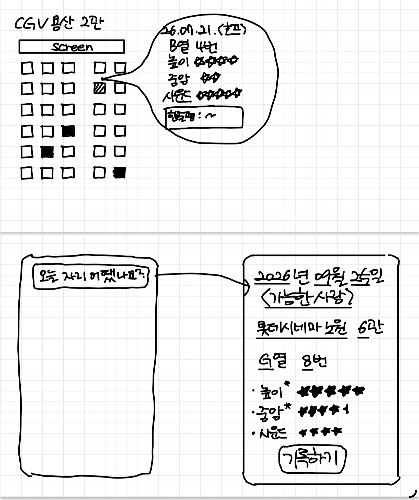

# Pitch

<!-- Under 500 words. -->

## Problem

<!-- one scene from your own life: when, what you did, what went wrong -->

I enjoy going to the movies and want to get the most out of it by sitting in a good seat, so **seat sightlines matter a lot to me**. I sometimes look up a theater's "best seats" (명당 자리) before booking, but I've ended up in seats too high for my below-average sitting height, or sides uncomfortable enough to be distracting. I once kept notes on which seat I sat in and how it felt for each film, but **eventually gave up because searching through them was a hassle**. I still want a good seat, even though the process tires me out.

## Who else?

<!-- one person other than you: what they did the last time it happened -->

A friend who watches movies often, volunteered at the Busan International Film Festival this year, and is considering a career in film once told me she'd thought about **just picking a fixed seat because deciding got annoying**. She has her own rule (center when watching with others, an end seat in the center block alone), but wanted to be rid of the fatigue of deciding every time.

## Existing solutions

<!-- what people use today, and why it isn't enough -->

Some people search for a theater's "best seats" (명당 자리) before booking. But this is **generalized information aimed at an unspecified average viewer**, so it doesn't account for individual differences like a shorter sitting height or higher sensitivity to sightlines. Services like 자리어때 cover seat views for sports stadiums and concert venues, but **not movie theaters**. In practice people most often reference sightline reviews posted on Naver blogs, which is unofficial and hard to search. Every existing option is built to produce one shared answer, which structurally can't solve a problem whose answer depends on the individual. That gap is why people improvise their own records instead: [one blogger](https://brunch.co.kr/@663s337/12) keeps a running list of the exact seats they've sat in and how each felt, admitting the entries follow no consistent format.

## Solution

<!-- the core flow as a sketch, and where its data comes from -->

Pick a theater and screen, and a **seat grid shows where I've sat before in that screen**. I can compare the seat I'm about to book against my past seats' relative positions in one view. Tapping a past seat shows the note and ratings (height, center/side, optionally sound) I left. A **notification around when the film ends prompts me to log the seat right there**, while the memory is fresh, so it's less likely to get put off and abandoned.

**Data:** the app needs seat layouts (rows, seats per row) for each screen, starting with theaters I actually go to and other high-traffic theaters.

## No-gos

<!-- at least three things worth doing that you won't -->

- No login/account system, data stays on device for now
- No automatic collection (crawling) of seat layouts for every theater/screen nationwide
- No photo or ticket scanning (OCR) input
- No similar-screen recommendations
- No other users' reviews or ratings
- No photo attachments, map view, or calendar integration